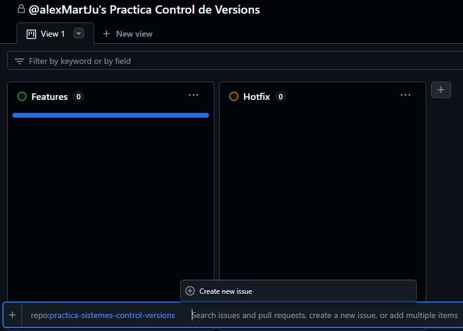
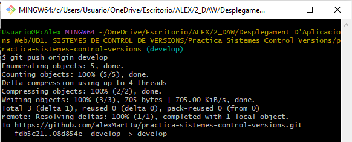
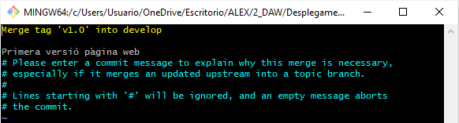
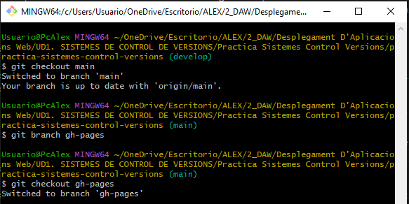

# Documentació de la Pràctica: Sistemes de Control de Versions

## 1. Introducció Teòrica

### 1.1 Què és Git?

Git és un sistema de control de versions distribuït que permet als desenvolupadors gestionar i registrar els canvis que es fan en un projecte de programari. Mitjançant Git, es poden crear diverses versions del projecte, treballar en elles simultàniament i fusionar els canvis en una branca principal quan es completen.

### 1.2 Què és Git Flow?

Git Flow és una metodologia de treball basada en Git, que defineix un conjunt de bones pràctiques per gestionar el cicle de vida del desenvolupament d'un projecte de programari. La seva estructura consisteix en diverses branques:

- **Master**: Conté les versions estables i alliberades del projecte.
- **Develop**: Branca principal per al desenvolupament on s'integren les noves funcionalitats.
- **Feature**: Rames temporals per desenvolupar noves característiques.
- **Release**: Rames per preparar una versió final abans de passar-la a la branca `master`.
- **Hotfix**: Rames per corregir errors crítics en la versió de producció.

### 1.3 Per què utilitzem Git Flow?

L'ús de Git Flow ens ajuda a mantenir una organització clara del projecte, assegurant que les noves funcionalitats es desenvolupin de manera independent i només es fusionin amb la branca principal (`develop` o `master`) quan estiguin completades i provades. Això permet tenir una estructura robusta i escalable, evitant errors en la integració de noves característiques o en la correcció de bugs.

---

## 2. Explicació del procés realitzat

### 2.1 Creació del repositori

Per a començar en la pràctica, crearem abans de tot el repositori en aquest cas, jo li he dit "practica-sistemes-control-versions"

    

### 2.2 Creació del projecte

1. Una vegada creat el repositori anirem a la pestanya de "Projects" i crearem un projecte de tipus "Board" i li afegim un nom.

    

2. Quan fem el pas anterior, vorem que ens apareixen unes columnes, eixes les borrarem i crearem dos columnes noves "Hotfix i Features".

    

3. Després de lo anterior, afegirem les issues desde el nostre repositori "practica-control-versions" mitjançant Add Item.

    

4. Crearem totes les issues que ens diu la pràctica, les quals son les features dels usuaris i e hotfix realitzat. Finalment, veurem com queda configurat el projecte.
 
    

### 2.3 Clonació del repositori i feature de l'estructura inicial (Usuari 1)

1. Amb l'Usuari 1 clonarem el repositori a local.

    

1. **Inicialitzar Git Flow**.
    Després, iniciarem el repositori de GitHub utilitzant Git Flow i configurarem el nom de les branques:
    
    

2. **Inicialitzar la feature**.
    Iniciem la primera feature "estructura-inicial". Ens creará una branca amb el mateix nom:

    

3. **Creació html i l'esructura inicial**.
    Una vegada fet lo anterior crearem un arxiu html en aquest cas li he dit "index.html" i li posarem l'estructura inicial que ens demana en la pràctica la qual es la capçalera, la barra de navegació amb l'accés a Home i el footer de la pàgina. A la part central del home també he inclós una breu descripció del curs. El html es el seguent:

    ```html
    <head>
        <meta charset="UTF-8">
        <meta name="viewport" content="width=device-width, initial-scale=1.0">
        <title>Práctica</title>
        <style>
            * {
                margin: 0;
                padding: 0;
                box-sizing: border-box;
            }

            body {
                font-family: Arial, sans-serif;
                border: 1px solid black;
            }

            header {
                background-color: #219ebc;
                text-align: center;
                padding: 30px;
                border-bottom: 1px solid black;
            }

            header h1 {
                font-size: 18px;
            }

            nav {
                border-bottom: 1px solid black;
            }

            nav ul {
                list-style: none;
                display: flex;
                justify-content: space-around;
                padding: 0;
            }

            nav ul li {
                width: 25%;
                text-align: center;
            }

            nav ul li a {
                display: block;
                padding: 15px;
                text-decoration: none;
                color: black;
                border-left: 1px solid black;
            }

            nav ul li:first-child a {
                border-left: none;
            }

            nav ul li a:hover {
                background-color: #219ebc;
            }


            main {
                min-height: 300px;
                margin: 0 auto;
                width: 100%;
                display: flex;
                flex-direction: column;
                justify-content: flex-start;
                align-items: center;
                gap: 20px;
            }

            main section {
                border-bottom: 1px solid #333;
                padding: 50px;
                width: 100%;
                text-align: center;
                background-color: white;
            }

            footer {
                text-align: center;
                padding: 30px;
                border: 1px solid black;
                background-color: #219ebc;
            }
        </style>
    </head>

    <body>
        <header>
            <h1>Curso de JavaScript aplicado a HTML</h1>
        </header>

        <nav>
            <ul>
                <li><a href="#inicio">Home</a></li>
            </ul>
        </nav>

        <main>
            <section id="inicio">
                <p>Este curso proporciona una introducción al JavaScript aplicado a las interacciones con elementos HTML.
                </p>
            </section>
        </main>

        <footer>
            <p>&copy; 2024 Curso de JavaScript y HTML</p>
        </footer>
    </body>
    ```

4. **Comprovament estat, add i commit**.
    Posteriorment, comprobarem l'estat ii afegirem els canvis a l'àrea de preparació i realitzarem un commit aon tancarem la issue:

    

5. **Integració feature a develop**.
    Integrarem la branca de feature creada amb la branca develop.

    

6. **Pujada de canvis a la branca develop en remot**.
    Finalment, pujaren els canvis a la branca develop en el repositori remot amb un push.

    

### 2.4 Desenvolupament de les funcionalitats (Usuari 2)

## __Feature contingutHTML__

Amb l'usuari 2, realitzarem els seguents pasos:

1. **Inicialitzar la feature**.Iniciem la feature "contingutHTML". Ens creará una branca amb el mateix nom:
   
    

2. **Modificació del contingut HTML i styles**.
    He modificat els styles i el html afegint lo seguent:
    
    ```html
    section h2 {
        margin-bottom: 10px;
    }

    button {
        background-color: #219ebc;
        padding: 10px;
        cursor: pointer;
    }

    button:hover {
        background-color: #197b98;
    } 
    ```

    ```html
    <li><a href="#modificar_contenido_html">Modificar contenido HTML</a></li>
    
    <!-- Aquest exemple mostra com modificar el contingut d'un element HTML utilitzant JavaScript i la propietat innerHTML. -->
    <section id="modificar_contenido_html">
        <h2>Modificar contenido HTML</h2>
        <button onclick="document.getElementById('demo').innerHTML = 'El contenido ha sido modificado!'">Cambiar Contenido</button>
        <p id="demo">Este es el contenido original.</p>
    </section>
    ```

3. **Comprovament estat, add i commit**.
   Posteriorment, comprobarem l'estat ii afegirem els canvis a l'àrea de preparació i realitzarem un commit aon tancarem la issue:

    

4. **Integració feature a develop**.
    Una vegada, hem realitzat la feature, la integrarem a la branca develop:

    
    
5. **Pujada de canvis a la branca develop en remot**.
    Finalment, pujaren els canvis a la branca develop en el repositori remot amb un push.

    

## __Feature atributsHTML__

Amb l'usuari 2, realitzarem els seguents pasos:

1. **Inicialitzar la feature**.Iniciem la feature "atributsHTML". Ens creará una branca amb el mateix nom:
   
    

2. **Modificació dels atributs HTML**.
    He modificat el html afegint lo seguent:

    ```html
    <li><a href="#modifcar_atributos_html">Modificar atributos HTML</a></li>
    
    <!-- Aquest exemple mostra com modificar els atributs d'un element HTML utilitzant JavaScript. -->
    <section id="modifcar_atributos_html">
        <h2>Modificar estilos CSS</h2>
        <button onclick="document.getElementById('cssDemo').style.color = 'red'">Cambiar Color</button>
        <p id="cssDemo">Este texto cambiará de color.</p>
    </section>
    ```

3. **Comprovament estat, add i commit**.
   Posteriorment, comprobarem l'estat i afegirem els canvis a l'àrea de preparació i realitzarem un commit aon tancarem la issue:

    

4. **Integració feature a develop**.
    Una vegada, hem realitzat la feature, la integrarem a la branca develop:

    
    
5. **Pujada de canvis a la branca develop en remot**.
    Finalment, pujaren els canvis a la branca develop en el repositori remot amb un push.

    
    
### 2.5 Desenvolupament d'estils CSS i Release (Usuari 3)

## __Feature estilsCSS__

Amb l'usuari 3, realitzarem els seguents pasos:

1. **Inicialitzar la feature**.
    Iniciem la feature "estilsCSS". Ens creará una branca amb el mateix nom:
   
    

2. **Modificació de l'estil CSS**.
    He modificat el html afegint lo seguent:

    ```html
    <li><a href="#modificar_estilos_css">Modificar estilos CSS</a></li>
    
    <!-- Aquest exemple mostra com modificar els estils CSS d'un element HTML utilitzant JavaScript. -->
    <section id="modificar_estilos_css">
        <h2>Modificar atributos HTML</h2>
        <button onclick="document.getElementById('myImage').src='https://www.w3schools.com/js/pic_bulbon.gif'">Cambiar Atributo</button>
        
    </section>
    ```

3. **Comprovament estat, add i commit**.
   Posteriorment, comprobarem l'estat i afegirem els canvis a l'àrea de preparació i realitzarem un commit aon tancarem la issue:

    

4. **Integració feature a develop**.
    Una vegada, hem realitzat la feature, la integrarem a la branca develop:

    
    
5. **Pujada de canvis a la branca develop en remot**.
    Finalment, pujaren els canvis a la branca develop en el repositori remot amb un push.

    

## __Release v1.0__

Fins ara, totes les modificacions que hem fet a través de diverses feature estan acumulades a la branca develop. Ara, el següent pas és portar aquests canvis definitius a la branca main. Per això, l'usuari 3 crearà una nova branca release, que començarà a partir de develop, i que es fusionarà tant amb la branca main com amb develop.

Amb l'usuari 3, realitzarem els seguents pasos:

1. **Inicialitzar la release**.Iniciem la feature "v1.0". Ens creará una branca amb el mateix nom:
   
    

2. **Finalització de la release**.
    Finalitzarem, la release. Una vegada clavem el comando necessari per a tancar la release se'ns obrirà tres finestres aon tindrem que confirmar els merge a main i develop i li posarem un missatge al tag.

    

    

    

    

3. **Pujada de canvis a la branca develop i main en remot**.
   Finalment, pujaren els canvis a la branca develop i main en el repositori remot amb un push:

    

### 2.6 Hotfix (Usuari 1)

Després de haver realitzat tots els procesos anteriors, amb l'Usuari 1 detectem millores necessàries en la secció del contingut creada per l'Usuari 2. Per això, crearem un hotfix i seguirem els seguents pasos:

1. **Inicialitzar la release**.
    Iniciem el hotfix "v1.0". Ens creará una branca amb el mateix nom:

    
    
2. **Comprovament estat, add i commit**.
   Posteriorment, comprobarem l'estat i afegirem els canvis a l'àrea de preparació i realitzarem un commit aon tancarem la issue:

    

3. **Finalització del hotfix**.
    Finalitzarem, el hotfix. Una vegada clavem el comando necessari per a tancar el hotfix se'ns obrirà tres finestres aon tindrem que confirmar els merge a main i develop i li posarem un missatge al tag.

    

    

    

    

4. **Pujada de canvis a la branca develop i main en remot**.
   Finalment, pujaren els canvis a la branca develop i main en el repositori remot amb un push:

    
    
    
### 2.7 GitHub Pages

## __Deixar buit gh-pages__

1. **Creació branca gh-pages**.
    Es mourem a la branca de main, crearem la branca "gh-pages" i es mourem a ella:

    

2. **Eliminació contingut que s'ha passat de main a gh-pages**.
    Eliminem aquest arxius i realitzem un commit

    

3. **Pujarem els canvis a la branca gh-pages en remot**.
    Realitzarem el comando "git push origin gh-pages" per a pujar els canvis a la branca "gh-pages" en remot.

## __Creació arxiu md i carpeta de captures__

1. **Creació arxiu md i carpeta imatges i comprovament estat, add i commit**.
    Crearem el arxiu .md aon posarem la documentació de la pràctica i la carpeta aon aniràn les captures.
    UNa vegada fet això, comprobarem l'estat i afegirem els canvis a l'àrea de preparació i realitzarem un commit:

    

2. **Pujarem els canvis a la branca gh-pages en remot**.

    

3. **Repetició de passos**.
    Els pasos 1 i 2 es repetiràn fins que quede el .md configurat correctament.

## __Associació branca gh-pages per a crear la nostra GitHub Page__

Per a conseguir la creació de la nostra pàgina GitHub Page associant-la a la branca gh-pages, anirem a settings/pages i ho configurarem de la seguent manera:
    

### 2.8 Colaboradors
Per a conseguir afegir un colaborador, anirem a settings/Collaborators i en l'apartat de Manage Access,
afegirem a antoni-gimenez clicant sobre "Add people":
    